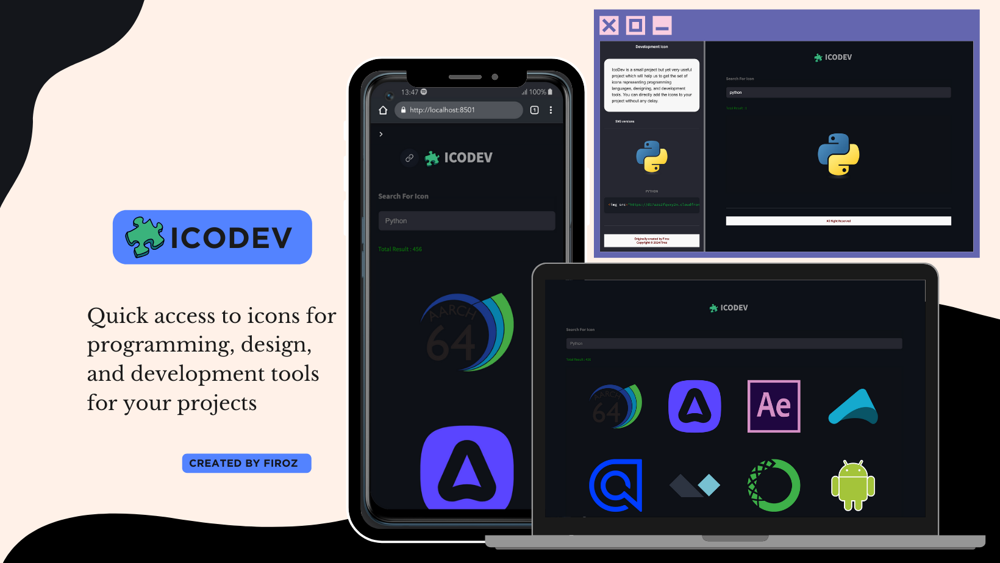

<h1 align="left" style="display: flex; align-items: center;">
  
    IcoDev — Instant SVG Icons for Developers, Designers & Tech Projects
</h1>


**IcoDev** is a lightweight, fast-loading icon library providing high-quality, ready-to-use SVG icons for popular **programming languages**, **design tools**, and **developer platforms.**

Perfect for building developer portfolios, tech blogs, landing pages, or project documentation, IcoDev lets you quickly integrate clean, minimal icons without downloading files or complex setup.


<br>

> [!TIP] 
> Stop searching for icons manually — just plug & play with IcoDev.

<br>

<p align="left">
  <!-- Front-End -->
   &nbsp;
   &nbsp;
   &nbsp;
   &nbsp;
   &nbsp;
   &nbsp;

</p>


<br><br>

<p align="center">
  
</p>
<br><br>


> [!IMPORTANT]
>
> ### Why I Built IcoDev
> As a developer building my personal portfolio, I kept running into a frustrating problem — I just wanted to add clean, high-quality icons for tech tools like React, VS Code, Figma, or Python. But the process was a hassle:
>
> - I had to search manually for each icon
> - Download it
> - Remove the background
> - Resize it so it doesn't mess with layout
> - And still hope it looks good across platforms...
>
> It was a tedious, repetitive job for something that should be plug-and-play — like how Bootstrap Icons or Google Material Icons work. But those don’t cover developer- and designer-specific tools.
>
> So I built IcoDev.
>
> A platform that gives you beautiful, HD SVG icons for programming languages, dev tools, and design software — instantly usable, clean, and CDN-ready.

<br> 

> [!TIP] 
> ### ⚡ Features
> - A curated set of icons for dev & design tools
> - CDN-ready — use anywhere, instantly
> - Easy integration with HTML, Markdown, or frameworks
> -  Ideal for resumes, portfolios, dashboards, and tech blogs
>

<br>

> [!NOTE]
>
> Follow these steps to get started with IcoDev:
>
> **Step 1:**  
> Clone the repository  
> ```bash
> git clone https://github.com/yourusername/IcoDev.git
> ```
>
> **Step 2:**  
> Change directory into the project folder  
> ```bash
> cd IcoDev
> ```
>
> **Step 3:**  
> Create a Python virtual environment  
> ```bash
> python3 -m venv myenv
> ```
>
> **Step 4:**  
> Activate the virtual environment  
> - On macOS/Linux:  
> ```bash
> source myenv/bin/activate
> ```
> - On Windows (PowerShell):  
> ```powershell
> .\myenv\Scripts\Activate.ps1
> ```
>
> **Step 5:**  
> Install required dependencies  
> ```bash
> pip3 install -r requirements.txt
> ```
>
> **Step 6:**  
> Run the Streamlit app  
> ```bash
> streamlit run main.py
> ```
>
> Now enjoy using IcoDev, or customize it further as needed!

<br>

## 👨‍💻 Author
For questions or support, reach out to:  

- [@buildwithfiroz](https://github.com/buildwithfiroz)
- buildbyfiroz@icloud.com  
